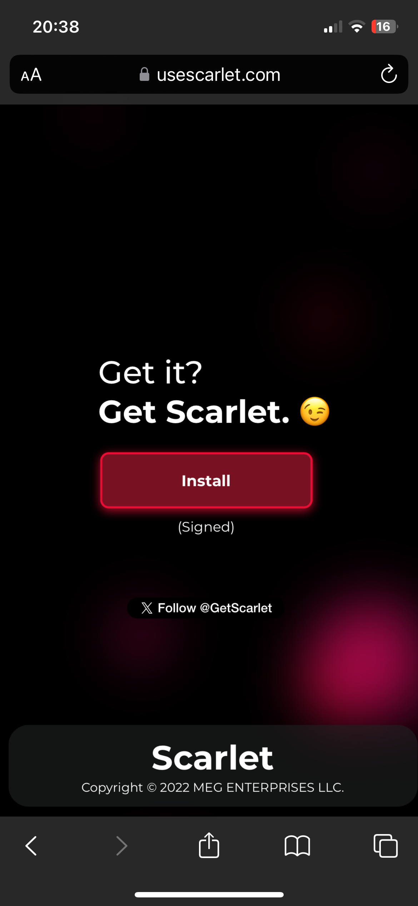
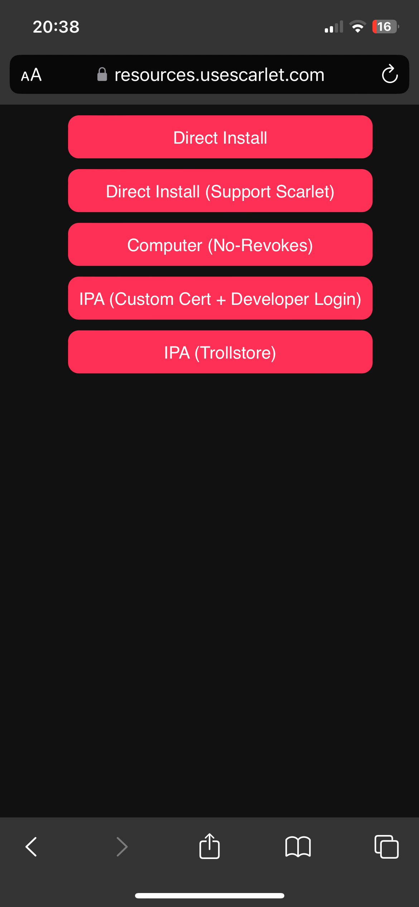

# Tuner Radio Plus download for iOS

### This app was removed from app store but there's another way to install it

## Steps:

- Clone this repository or just download .ipa file
- Go to website `https://usescarlet.com` and scroll down to the install button

- Click it, then click on button `Direct install`

- It will throws 2 pop-ups, to open iTnunes and "Install Scarlet" Click yes in both

- Some iPhone/iPad has a devoloper mode, if yours has do the following steps

    - Go to settings -> Privacy and Security -> Developer Mode and active it

- After scarlet installed, go to settings -> general -> VPN & Device management and trust scarlet.

- Then open scarlet app and import the ipa file to download

- Enjoy :)